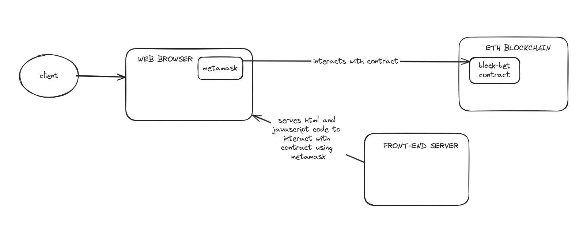

# block-bet

## Business Model Canvas: [BMC Link](https://www.canva.com/design/DAGBaQGA1xA/xKYAZAaZ9XhfqMiSRokO1Q/edit?utm_content=DAGBaQGA1xA&utm_campaign=designshare&utm_medium=link2&utm_source=sharebutton)

## Arquitetura


* Nosso servidor front-end é baseado em nuxt.js, um framework para criar components em vue.js, nossa biblioteca usada para reatividade nas páginas web. Se encontra em ./frontend neste repositório
* Nosso contrato e as configurações para rodar uma rede local ficam em ./server neste repositório. Usamos ganache para rodar a rede local e truffle para compilar e fazer deploy do contrato da rede. Além disso, o truffle traz um console interativo para usar o contrato e tests automatizados para testar o contrato.
* Usamos o metamask para realizar a interação com a rede ethereum, no caso desse projeto apenas a rede local com ganache.

## Como rodar o projeto

### Dependências
Para rodar o projeto é necessário ter docker e docker compose instalados e o make.
Tanto a rede local do ethereum quanto a servidor do frontend rodam em containers docker que são adiministradados através do ./docker-compose.yaml.
Além disso é necessário ter o metamask instalado para interagir com a aplicação web e o consequentemente com o contrato.

### Rodando o projeto

Primeiramente é necessário subir o servidor ganache:

```
make server-up
```

Depois, é necessário compilar o contrato:

```
make compile
```

Migrar o contrato para o servidor ganache:

```
make migrate
```

Para subir o servidor com o front-end da aplicação.
O servidor fica disponível em localhost:3000

```
make front-end
```

### Rodando o truffle console


Rodar o console:

```
make console
```

Carregue o contrato em uma constante:
```
const contract = await BlockBet.deployed()
```

Para criar uma aposta, você deve chamar a função `createBet` na instância.
E possivel passar um endereco de um apostador no momento de criar a bet:

```
    let accounts = await web3.eth.getAccounts();
    contract.createBet(1, 'teste de aposta nada a ver', {from: accounts[0], value: 100})
```

Para ver as apostas criadas, chame a função `getBets`:

```
    contract.getBets()
```

Pegue o uuid da aposta e armazene em uma constante:

```
    const uuid = 'uuid da aposta criada'
```

Para desafiar uma aposta, chame a função `challengeBet`:

```
contract.challengeBet(uuid, {from: accounts[1], value: 100})
```

Para votar no vencedor de uma aposta, chame a função `voteWinner`:

```
contract.voteWinner(uuid, 1, {from: accounts[0]})
```

Se os votos forem iguais, automaticamente o contrato finaliza a aposta e distribui o valor para o vencedor.
Do contrário, o contrato fica em estado de auditoria.

Para auditar uma aposta, chame a função `auditBet`:

```
contract.auditBet(uuid, 2, {from: accounts[3]})
```
